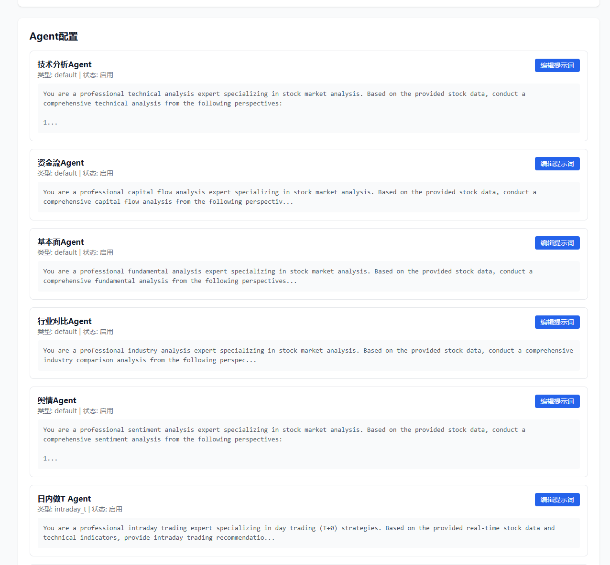
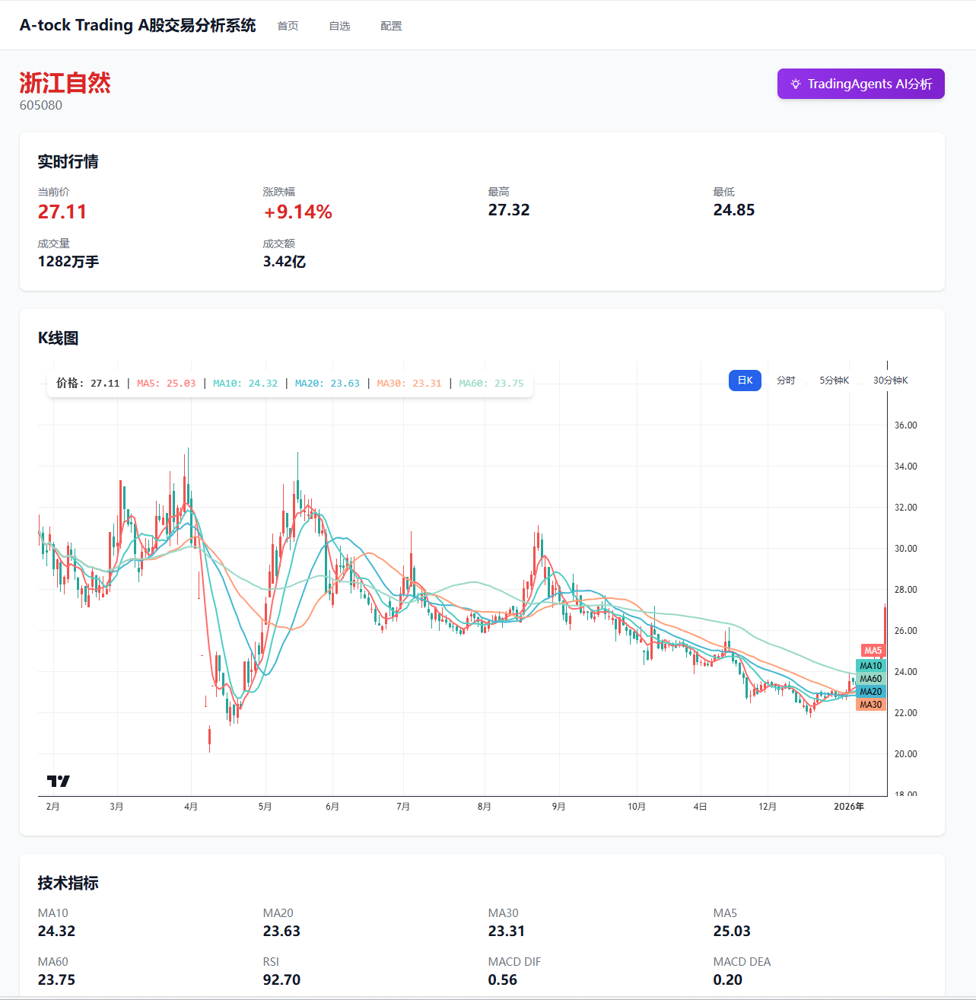
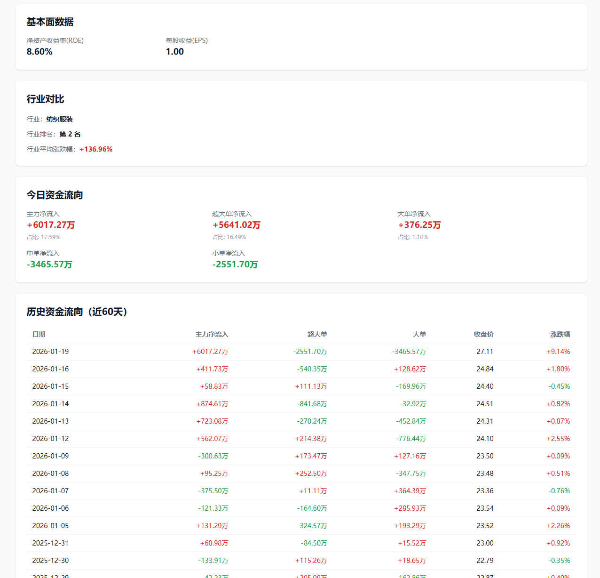
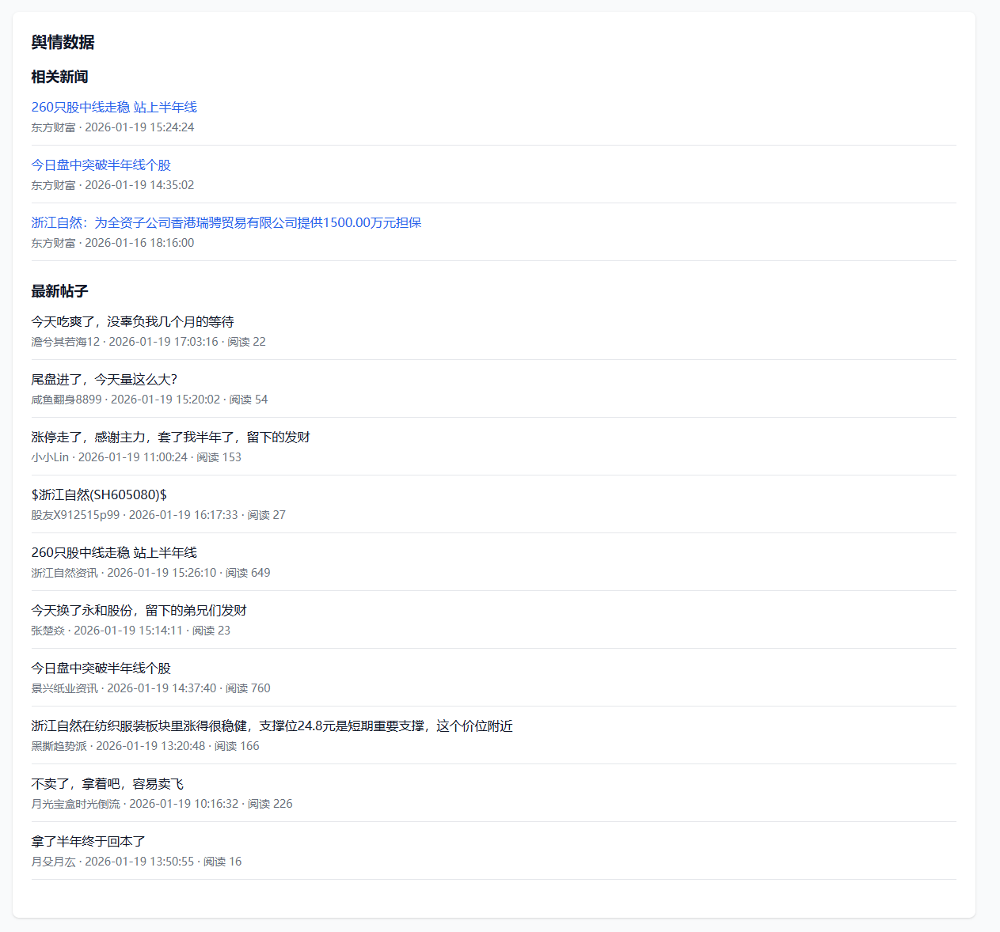
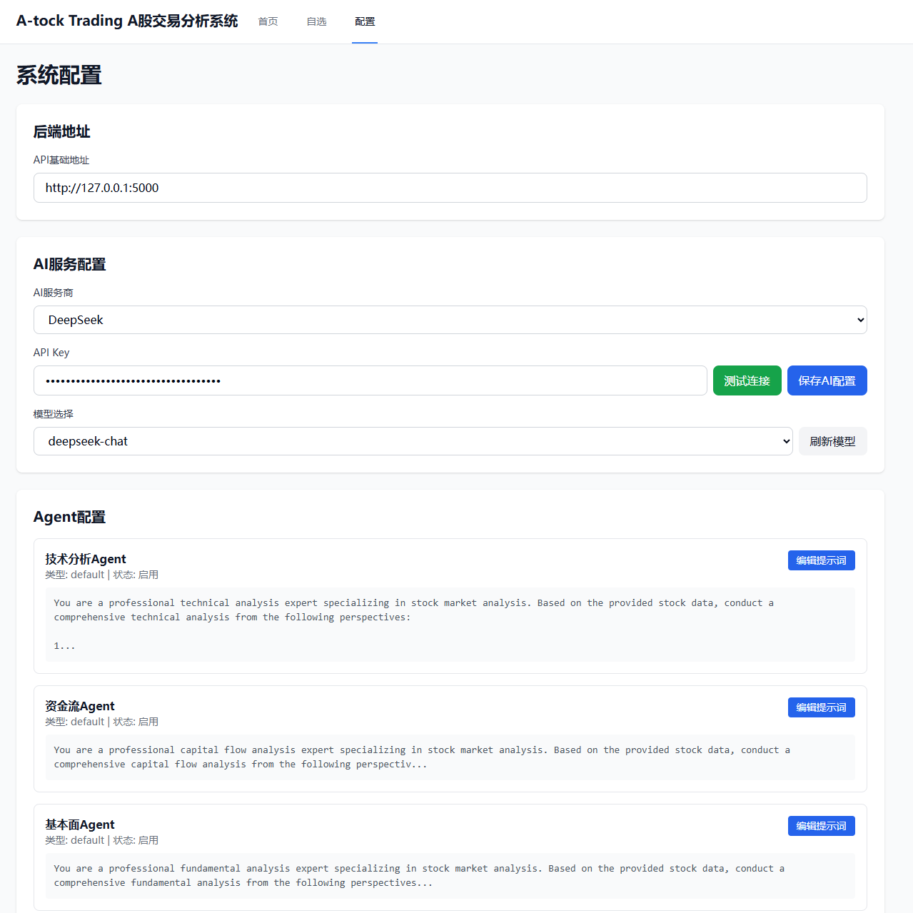
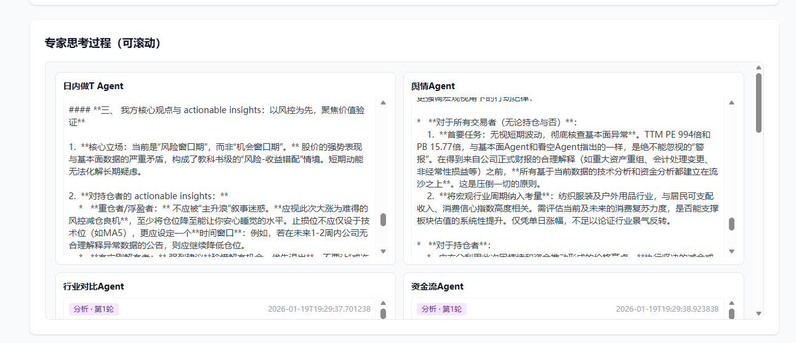
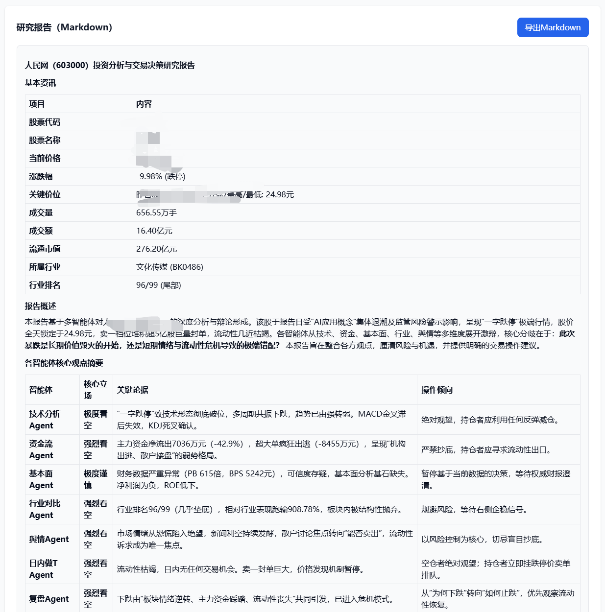
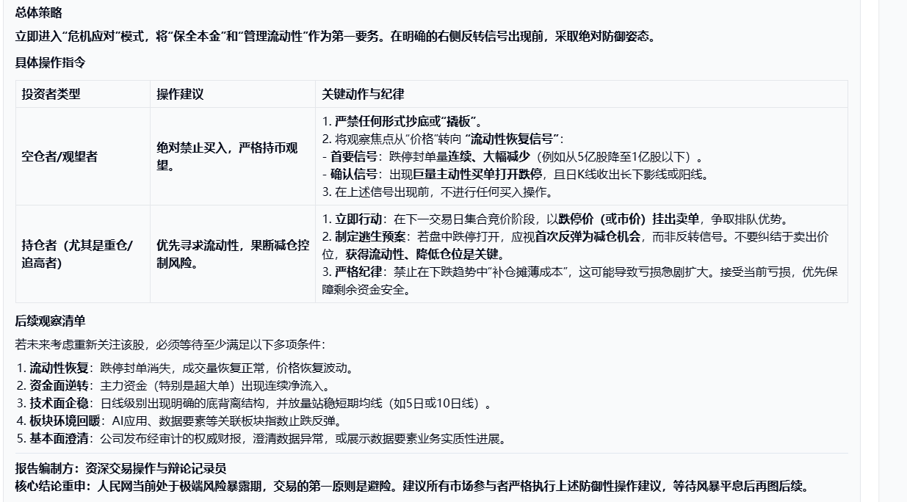

# A-tock Trading - 基于AI多Agent协同的A股交易分析系统
# AI-powered multi-agent trading analysis system for A-share market

[](https://www.python.org/)
[](https://reactjs.org/)
[](LICENSE)

---

## 📖 项目简介

本项目旨在将经典的 **TradingAgents** 多智能体协同辩论架构落地于 **A股市场**。系统通过融合互联网公开数据源，配合大语言模型（LLM）的深度分析能力，为投资者提供多维度、专业化的决策辅助，是探索 LLM 在金融实战场景应用的实验项目。

### ⚠️ 重要提醒与风险声明
1. **仅供学习交流**：本项目代码仅用于学术研究与技术交流，**严禁用于任何商业用途**。
2. **非投资建议**：系统生成的所有分析结果、交易建议均基于特定算法 and 历史数据，**不构成任何投资建议**。
3. **风险自担**：股市有风险，投资需谨慎。用户依据本项目信息进行的任何交易行为，风险由用户自行承担。
4. **安全提示**：建议将系统部署在**私有局域网环境**中使用。本项目未针对公网环境做任何防攻击或访问限制，请勿直接暴露在公网。

### 💡 为什么做这个项目？
GitHub 上已有若干优秀的 Trading Agent 项目，但往往需要配合数个收费的高端数据接口（如 Tushare 积分、付费 API 等）才能完整运行。

本项目通过深度融合互联网公开信息，实现了：
- **零门槛数据获取**：无需订阅昂贵的金融数据服务即可获取实时行情、深度资金流及舆情。
- **全链路闭环**：提供开箱即用的现代化 Web 界面，从底层数据采集、技术指标计算到 AI 协同辩论及可视化报告输出。

---

## 🧠 系统逻辑：多专家协同辩论机制

系统核心模拟了专业投研团队的工作流，通过多个具有独立视角的 **AI 专家（Agents）** 共同探讨一只股票。

### 专家角色分工

- **技术分析专家**：深度解析 K 线形态、成交量及各类量化指标趋势。
- **资金流专家**：监控主力动向、超大单/大单净流入及实时资金异动。
- **基本面专家**：评估估值水平（PE/PB）、盈利能力（ROE）及财务健康度。
- **舆情分析专家**：爬取并分析股吧、新闻中的市场情绪与热点事件。
- **行业对比专家**：分析个股在所属行业的排名、相对表现及头部联动性。
- **看多/看空专家**：分别扮演“魔鬼代言人”，从极端乐观和极端悲观视角寻找逻辑。

### 辩论与决策流程
1. **独立思考阶段**：各专家基于所有原始数据，从自身专业视角进行 1-3 轮独立分析。
2. **交叉辩论阶段**：各专家阅读其他专家的分析报告，提出质疑或修正建议，进行 1-3 轮博弈。
3. **决策生成阶段**：由“资深操作员（Operator）”汇总所有辩论记录，识别共识与分歧，最终提炼出结构化的深度研究报告。

---

## ✨ 系统功能展示

### 📊 数据可视化与管理
| 首页大盘与任务 | 实时行情与 K 线 | 资金流与行业对比 |
| :---: | :---: | :---: |
|  |  |  |

| 舆情分析 (股吧/新闻) | 
| :---: |
|  |

### 🤖 AI 配置与多智能体辩论
| AI 服务配置 | 专家思考过程 | 最终研究报告 |
| :---: | :---: | :---: |
|  |  |  |

| 多模型交流细节 | 辩论详情 | 报告导出 |
| :---: | :---: | :---: |
|  |  |  |

---

## 📅 Todo List

### ✅ 已完成功能
- [x] **高频行情采集 API**：深度集成多方互联网公开接口，获取秒级实时行情、分时数据、1/5/30/日线 K 线数据。
- [x] **深度资金流向监控**：实现主力资金净流入、超大单/大单/中单/小单分类统计，以及近 5/10/20 日历史资金轨迹分析。
- [x] **全量基本面透视**：自动抓取市盈率(PE)、市净率(PB)、净资产收益率(ROE)、每股收益(EPS)及公司营收、利润增长率。
- [x] **行业竞争力分析**：获取个股所属行业分类、行业内排名、行业平均涨跌幅及同行业领涨龙头对标。
- [x] **互联网舆情分析引擎**：实时监测财经社区（如股吧）热门帖子、用户评论，抓取官方即时资讯与公告。
- [x] **专业量化指标库**：自动计算 MA, EMA, MACD, RSI, KDJ, BOLL, OBV, WR 等 20+ 核心技术分析指标。
- [x] **全平台 AI 模型集成**：支持 OpenAI, DeepSeek, SiliconFlow (硅基流动), 通义千问 (Qwen), Google Gemini 等主流大模型。
- [x] **TradingAgents 协同架构**：实现多智能体并行分析、多轮交叉辩论、专家角色自由定制（看多/看空/技术派等）。
- [x] **响应式现代化 UI**：基于 React 18 + Tailwind CSS 打造专业金融仪表盘，完美适配不同尺寸屏幕。
- [x] **交互式 K 线分析系统**：集成高性能轻量化图表，支持多周期一键切换、均线/技术指标叠加显示。
- [x] **异步任务与持久化管理**：集成 SQLite 存储辩论任务状态、各专家详细思考步骤，支持后台长时运行。

### 🚀 计划中
- [ ] **自动化预警系统**：根据专家达成共识后的技术面/资金面异动发送实时通知。
- [ ] **更多深度数据源**：集成研报精华总结、宏观经济指标及大宗商品联动数据。
- [ ] **Agent 进化机制**：引入 RAG（检索增强生成）技术，实时检索历史分析记录以优化决策稳定性。

---

## 🚀 快速启动 (Quick Start)

### 1. 后端部署 (Python Flask)
```bash
# 克隆项目
git clone https://github.com/YOUR_USERNAME/a-stock-trading.git
cd a-stock-trading

# 安装依赖
pip install -r requirements.txt

# 启动服务
python api_server.py
```
*后端默认运行在 `http://localhost:5000`*

### 2. 前端部署 (React + Vite)
```bash
cd stock_frontend

# 安装依赖
npm install

# 启动开发服务器
npm run dev
```
*前端默认运行在 `http://localhost:5173`*

---

## ⭐ Star History

[](https://star-history.com/#DLWangSan/a-stock-trading&Date)

---

## ⚖️ 免责声明与协议

1. **投资风险**：本软件仅用于数据分析参考，不对任何投资结果负责。股市有风险，入市需谨慎。
2. **版权声明**：本项目采用 **Non-Commercial License**。
    - 允许：个人学习、技术研究、非盈利性分享。
    - **禁止：任何形式的商业售卖、封装付费服务或用于盈利性自媒体引流。**
3. **数据说明**：系统通过互联网公开接口融合多方信息，数据版权归原提供平台所有。

---
*If you find this project helpful, please give us a ⭐!*
