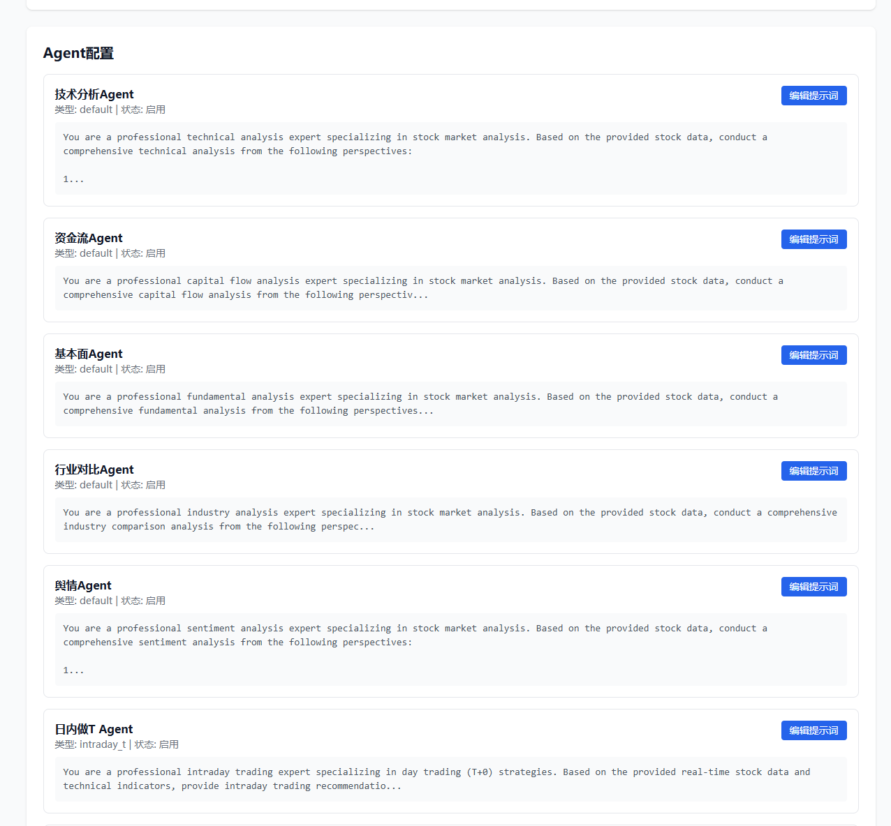
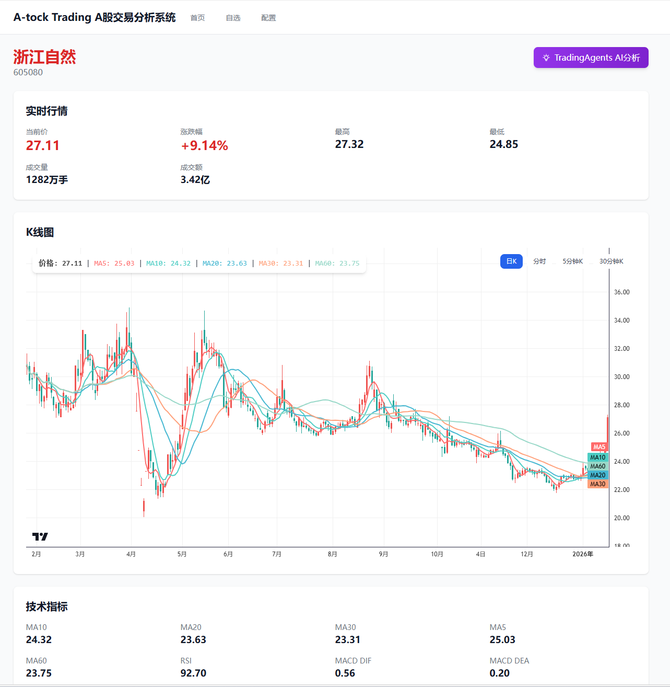
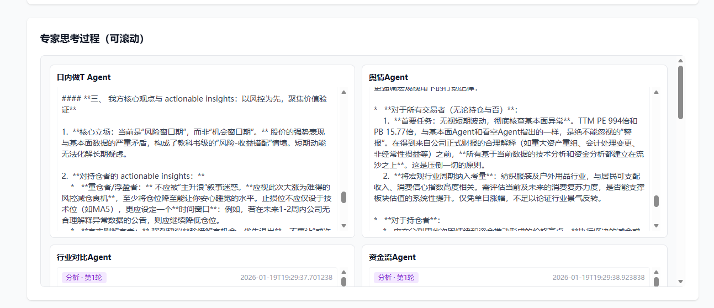
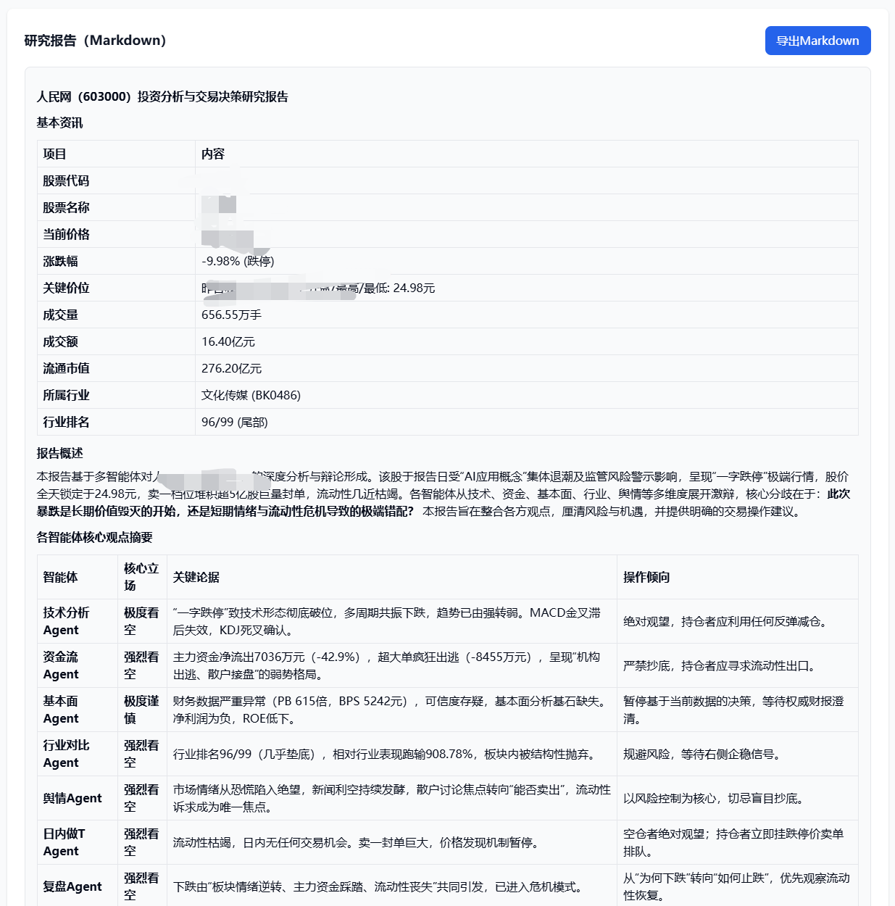

# A-Stock Trading

[English](README.md) | [简体中文](README.zh-CN.md)

[](https://www.python.org/)
[](https://react.dev/)


An AI-powered, multi-agent research and trading-assistance system built for the
China A-share market. It combines public market data, quantitative screening,
portfolio context, and LLM debate to produce practical account-level action
plans.

> [!WARNING]
> This project is for research and personal learning only. Its output is not
> investment advice. Market data may be delayed or unavailable, and all trading
> decisions and risks remain with the user. Do not expose the application
> directly to the public internet without adding authentication and rate limits.

## Product Preview


## Highlights

- **Multi-agent debate** — technical, capital-flow, fundamental, sentiment,
  industry, bullish, and bearish agents analyze the same evidence before an
  operator produces the final report.
- **Two stock-selection workflows** — keeps the early-limit-up strong-stock
  scanner and adds an independent market-wide Four Lights strategy.
- **Portfolio intelligence** — stores cash, risk limits, trading style, cost,
  available quantity, targets, stops, and holding thesis.
- **One-click portfolio analysis** — combines account exposure, every holding's
  trend, profit/loss, market breadth, major indices, and market sentiment into
  one prioritized action plan.
- **Action-oriented output** — supports explicit buy, sell, hold, position
  adjustment, intraday T-trading, stop-loss, take-profit, and `NO TRADE`
  decisions.
- **Signal tracking** — persists strategy snapshots and validates later returns
  for morning-to-afternoon or afternoon-to-next-session review.
- **A-share data pipeline** — real-time quotes, intraday and daily K-lines,
  technical indicators, capital flow, fundamentals, industry comparison, news,
  and community sentiment.
- **Multiple LLM providers** — OpenAI, DeepSeek, Qwen, Gemini, SiliconFlow, and
  Grok-compatible configuration.
- **Feishu integration** — a self-built Feishu bot can trigger the complete
  strategy-to-debate pipeline by command.

## TradingAgents-Inspired Research Team

This project draws inspiration from the collaborative research pattern of
[TradingAgents](https://github.com/TauricResearch/TradingAgents) and adapts it
to public A-share data, China-market indicators, local portfolio constraints,
and a browser-based workflow. It is not a drop-in copy of the upstream project;
the data adapters, prompts, task persistence, strategy scanners, portfolio
model, and user interface are implemented for this repository.

Instead of asking one model to make every judgment, the system simulates a
small investment-research desk:

- **Technical analyst** — K-line structure, moving averages, MACD, RSI, KDJ,
  BOLL, volume, and key price levels.
- **Capital-flow analyst** — main, super-large, large, medium, and small-order
  flows, including short-term persistence.
- **Fundamental analyst** — valuation, profitability, growth, and financial
  quality.
- **Sentiment analyst** — news, announcements, community discussion, and event
  risks.
- **Industry analyst** — peer ranking, sector strength, relative performance,
  and leader linkage.
- **Bull and bear researchers** — deliberately challenge the consensus from
  opposite directions.
- **Intraday and review agents** — focus on T-trading opportunities and test
  whether the original thesis still holds.
- **Operator / portfolio manager** — resolves disagreements and converts
  research into the final action plan.



The decision process has three stages:

1. **Independent analysis** — selected specialists receive the same market and
   account evidence and analyze it from their own mandates.
2. **Cross-agent debate** — agents inspect other opinions, challenge weak
   assumptions, and revise their conclusions over configurable rounds.
3. **Final decision** — the operator identifies consensus and conflicts, checks
   account constraints, and produces a structured Markdown report.

Single-stock and multi-stock tasks support quick, balanced, and deep modes. In
multi-stock mode, candidates are evaluated under a shared context, and the
operator may select a primary candidate, a backup candidate, or `NO TRADE`.

## Four Lights Strategy

The strategy scans liquid A-shares, preselects up to 30 candidates, and ranks
them by four independent signals. A stock is marked actionable when at least
three lights are on. The intended holding horizon is **1–5 trading days**.

### Trend light

The trend light turns on only when all of the following are true:

- current price is above MA5;
- `MA5 > MA10 > MA20`, forming a strict bullish moving-average alignment;
- MACD DIF is greater than or equal to MACD DEA.

This is deliberately strict. A strong rebound can pass momentum and volume
checks while the trend light remains off until MA10 rises above MA20. For
example, a candidate with `MA5 > MA20 > MA10` is improving, but has not yet
formed a fully confirmed bullish alignment.

### Momentum light

- RSI(14) is between 50 and 75;
- five-session return is above 0% and no more than 18%;
- current-session change is between -1.5% and 6%.

### Volume light

- turnover amount is at least CNY 300 million;
- turnover rate is between 2% and 15%;
- projected volume ratio is between 1.1 and 3.5.

### Capital light

- preferred rule: five-session main capital flow is positive with at least
  three positive sessions;
- fallback rule: when five-session history is unavailable, today's main inflow
  must be positive and its ratio must be at least 3%.

Capital-flow retrieval uses three layers: Eastmoney history first, optional
Tushare history when `TUSHARE_TOKEN` is configured, and local daily snapshots as
a long-term fallback. Local data is labeled as five-session data only after five
distinct trading sessions have been accumulated.

## Portfolio-Level Analysis

The **Analyze Entire Portfolio** action uses the default five complementary
agents and provides:

- market-regime and breadth assessment;
- total assets, cash, exposure, capacity, and concentration checks;
- per-holding trend, profit/loss, available quantity, and thesis review;
- prioritized actions with quantity or percentage adjustments;
- entry/exit triggers, stop-loss, take-profit, validity period, and T-trading
  plan;
- a cash and total-position plan consistent with the configured risk limits.

Held stocks are automatically synchronized to the watchlist.

## How It Works

1. Collect market, technical, capital-flow, fundamental, and sentiment data.
2. Inject trading profile and live portfolio context into every relevant prompt.
3. Run selected agents in parallel for independent analysis.
4. Let agents challenge or refine other opinions during debate rounds.
5. Use an operator model to reconcile evidence, constraints, and disagreements.
6. Persist steps and the final Markdown report for polling and export.

## Interface Gallery

### Market data and interactive K-line analysis



### Parallel specialist reasoning



### Structured final research report



## Project Structure

```text
.
├── api_server.py                  # Flask entry point
├── api_routes.py                  # Market, strategy, and AI task APIs
├── portfolio_routes.py            # Trading profile and position APIs
├── four_lights_strategy.py        # Four Lights market-wide scanner
├── strategy_scorer.py             # Strong-stock quantitative ranking
├── strategy_signal_service.py     # Signal persistence and validation
├── market_context_service.py      # Market sentiment snapshot
├── pipeline_feishu.py             # Feishu-triggered strategy pipeline
├── data_fetchers.py               # Public market-data adapters
├── technical_indicators.py        # Technical indicator calculations
├── models.py                      # SQLite models and migrations
├── docs/
│   └── feishu_setup.md
└── stock_frontend/                # React + TypeScript + Vite frontend
```

## Quick Start

### 1. Backend

```bash
git clone https://github.com/DLWangSan/a-stock-trading.git
cd a-stock-trading

pip install -r requirements.txt
python api_server.py
```

The backend runs at `http://localhost:5010` by default. Set `PORT` to override
the port.

### 2. Frontend

```bash
cd stock_frontend
npm install
npm run dev
```

The Vite development server runs at `http://localhost:5173`.

### 3. AI Configuration

Open **Settings** in the web application and configure at least one supported
provider, API key, and model. Enable at least two agents before starting a
debate. The default workflow selects five complementary core agents; users can
select more agents for deeper analysis.

Optional environment variable:

```env
TUSHARE_TOKEN=your_tushare_token
```

The application works without this token. It only adds a secondary historical
capital-flow source when the account has permission for Tushare's `moneyflow`
API.

## Feishu Command Pipeline

The backend supports a single command-triggered workflow:

1. execute a stock-selection strategy;
2. collect all selected stocks and market data;
3. run a multi-stock agent debate;
4. persist every analysis/debate step and final report;
5. optionally send status or result notifications to Feishu.

Main endpoints:

- `POST /api/pipeline/strategy_to_multi_debate`
- `POST /api/feishu/events`
- `GET /api/ai/debate/status/<job_id>`

See the complete setup guide in
[docs/feishu_setup.md](docs/feishu_setup.md).

## Key APIs

- `GET /api/strategy/strong_stocks` — ranked strong-stock candidates
- `POST /api/strategy/four_lights/scan` — execute a Four Lights scan
- `GET /api/strategy/four_lights/history` — signal history and validation
- `GET /api/portfolio` — account and portfolio snapshot
- `POST /api/portfolio/analyze` — one-click account-level analysis
- `POST /api/ai/debate/start/<code>` — single-stock debate
- `POST /api/ai/debate/start_multi` — multi-stock comparative debate
- `GET /api/ai/debate/status/<job_id>` — task progress, steps, and report

## Data Reliability

The project intentionally relies mainly on public internet endpoints, so an
upstream provider may throttle, change, or temporarily block requests. Critical
paths use timeouts, retries, caching, fallback sources, and explicit
data-completeness labels. For production-grade use, connect a licensed market
data provider and add authentication, observability, and scheduled backups.

## Development Checks

```bash
# Python syntax check
python -m compileall -q .

# Frontend production build
cd stock_frontend
npm run build
```

## License and Disclaimer

- Personal study, technical research, and non-profit sharing are allowed.
- Commercial resale, paid repackaging, and profit-oriented redistribution are
  prohibited.
- Data copyrights remain with their original providers.
- The maintainers accept no responsibility for trading losses or data errors.

If this project helps you, consider giving it a star.
