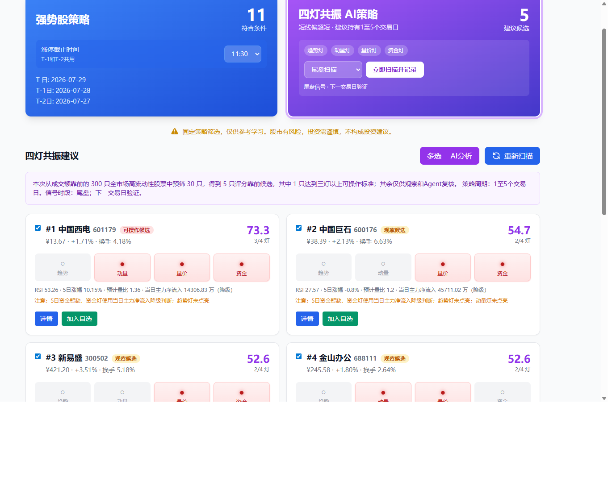

# A-Stock Trading

[English](README.md) | [简体中文](README.zh-CN.md)

[](https://www.python.org/)
[](https://react.dev/)


面向中国 A 股市场的 AI 多智能体研究与交易辅助系统。项目融合公开行情数据、
量化策略筛选、个人账户与持仓上下文，以及多模型协同辩论，最终输出可执行的
账户级操作方案。

> [!WARNING]
> 本项目仅供技术研究与个人学习，所有输出均不构成投资建议。公开数据源可能存在
> 延迟、中断或口径差异，任何交易行为及风险由用户自行承担。项目默认没有完整的
> 公网安全防护，请勿在未增加鉴权和限流的情况下直接暴露到互联网。

## 产品预览



## 核心能力

- **多 Agent 协同辩论**：技术、资金、基本面、舆情、行业、看多和看空等专家
  基于同一份证据独立分析，再由操作员模型汇总最终报告。
- **双策略选股**：保留首板强势股策略，新增独立的全市场四灯共振策略。
- **完整持仓管理**：记录现金、仓位上限、交易风格、成本、可卖数量、目标价、
  止损价和持仓逻辑。
- **一键分析全部持仓**：综合账户仓位、全部持仓走势与盈亏、市场宽度、主要指数
  和市场情绪，给出按优先级排序的操作方案。
- **明确的操作输出**：支持买入、卖出、持有、调仓、做 T、止损、止盈以及
  `NO TRADE`，不强制生成交易。
- **信号留存与验证**：保存策略快照，支持早盘到下午、下午到下一交易日的收益验证。
- **A 股数据链路**：覆盖实时行情、分时与日 K、技术指标、资金流、基本面、
  行业对比、新闻和社区舆情。
- **多模型支持**：可配置 OpenAI、DeepSeek、通义千问、Gemini、SiliconFlow
  以及 Grok 兼容服务。
- **飞书机器人**：可通过自建应用机器人指令触发完整的策略筛选与多股辩论流程。

## 四灯策略

策略从高流动性 A 股中进行预筛选，最多分析 30 只候选，再按趋势、动量、量价和
资金四个独立信号排序。至少点亮三灯才标记为“可操作候选”，建议持有周期为
**1–5 个交易日**。

### 趋势灯

必须同时满足以下条件才会点亮：

- 当前价格高于 MA5；
- `MA5 > MA10 > MA20`，形成严格的均线多头排列；
- MACD DIF 大于或等于 MACD DEA。

这个条件是有意设置得较严格。部分股票虽然当天反弹较强、动量和量价灯已经点亮，
但如果 MA10 仍在 MA20 下方，就说明中短期均线尚未完成多头排列，趋势灯不会提前
点亮。例如 `MA5 > MA20 > MA10` 代表趋势正在改善，但还不属于完整确认。

### 动量灯

- RSI(14) 位于 50–75；
- 最近五个交易日涨幅大于 0% 且不超过 18%；
- 当日涨跌幅位于 -1.5% 至 6%。

### 量价灯

- 当日成交额不少于 3 亿元；
- 换手率位于 2%–15%；
- 按交易时段折算的预计量比位于 1.1–3.5。

### 资金灯

- 优先规则：最近五个交易日主力资金累计净流入为正，且至少三个交易日净流入；
- 降级规则：五日历史暂缺时，当日主力净流入必须为正，且净流入占比不低于 3%。

资金数据采用三层方案：优先东方财富历史数据；配置 `TUSHARE_TOKEN` 后使用
Tushare 备用数据；两个外部历史源都不可用时，本地逐日累计快照。只有凑满五个
不同交易日，本地数据才会标记为“五日资金”，不会把单日数据误标为五日。

## 持仓整体分析

持仓页的“一键分析全部持仓”默认使用五个互补的核心 Agent，输出内容包括：

- 市场环境、指数表现和市场宽度判断；
- 总资产、现金、总仓位、剩余容量和集中度体检；
- 每只持仓的趋势、盈亏、可卖数量和持仓逻辑复核；
- 按优先级排列的操作，以及明确的数量或仓位调整幅度；
- 价格触发条件、止损、止盈、有效期和做 T 计划；
- 符合账户风险限制的现金与总仓位安排。

已持有的股票会自动同步到自选股。

## 工作流程

1. 获取行情、技术指标、资金流、基本面和舆情数据。
2. 将交易风格、账户约束及实时持仓注入相关 AI 提示词。
3. 并行执行所选 Agent 的独立分析。
4. 在辩论轮次中互相质疑并修正判断。
5. 由操作员模型综合证据、账户约束和分歧。
6. 持久化全部步骤及最终 Markdown 报告，供轮询和导出。

## 目录结构

```text
.
├── api_server.py                  # Flask 服务入口
├── api_routes.py                  # 行情、策略和 AI 任务 API
├── portfolio_routes.py            # 账户与持仓 API
├── four_lights_strategy.py        # 四灯全市场策略
├── strategy_scorer.py             # 强势股量化评分
├── strategy_signal_service.py     # 策略信号保存与验证
├── market_context_service.py      # 市场情绪快照
├── pipeline_feishu.py             # 飞书指令触发流水线
├── data_fetchers.py               # 公开数据源适配
├── technical_indicators.py        # 技术指标计算
├── models.py                      # SQLite 模型与轻量迁移
├── docs/
│   └── feishu_setup.md
└── stock_frontend/                # React + TypeScript + Vite 前端
```

## 快速启动

### 1. 后端

```bash
git clone https://github.com/DLWangSan/a-stock-trading.git
cd a-stock-trading

pip install -r requirements.txt
python api_server.py
```

后端默认运行在 `http://localhost:5010`，可通过环境变量 `PORT` 覆盖。

### 2. 前端

```bash
cd stock_frontend
npm install
npm run dev
```

Vite 开发服务器默认运行在 `http://localhost:5173`。

### 3. AI 配置

进入网页端“设置”，配置至少一个支持的服务商、API Key 和模型。启动辩论前至少
启用两个 Agent。系统默认选择五个互补核心 Agent，用户也可以选择更多 Agent 进行
更深入的分析。

可选环境变量：

```env
TUSHARE_TOKEN=your_tushare_token
```

没有该 Token 也可正常运行；只有具备 Tushare `moneyflow` 接口权限时，它才会作为
历史资金流备用源。

## 飞书指令流水线

后端支持通过一条机器人指令完成以下流程：

1. 执行选股策略；
2. 收集全部候选股票及其市场数据；
3. 启动多股 Agent 对比辩论；
4. 保存所有分析、辩论步骤和最终报告；
5. 按配置向飞书发送状态或结果通知。

主要接口：

- `POST /api/pipeline/strategy_to_multi_debate`
- `POST /api/feishu/events`
- `GET /api/ai/debate/status/<job_id>`

完整配置方法见 [docs/feishu_setup.md](docs/feishu_setup.md)。

## 主要 API

- `GET /api/strategy/strong_stocks`：强势股评分结果
- `POST /api/strategy/four_lights/scan`：执行四灯扫描
- `GET /api/strategy/four_lights/history`：信号历史与验证
- `GET /api/portfolio`：账户与持仓快照
- `POST /api/portfolio/analyze`：一键账户级分析
- `POST /api/ai/debate/start/<code>`：单股辩论
- `POST /api/ai/debate/start_multi`：多股对比辩论
- `GET /api/ai/debate/status/<job_id>`：任务进度、步骤与报告

## 数据可靠性

项目主要依赖公开互联网接口，上游服务可能限流、调整接口或临时阻断请求。关键链路
已增加超时、重试、缓存、备用数据源和数据完整性提示。若用于更严肃的生产场景，
建议接入有授权的行情服务，并补充鉴权、监控和定期备份。

## 开发检查

```bash
# Python 语法检查
python -m compileall -q .

# 前端生产构建
cd stock_frontend
npm run build
```

## 协议与免责声明

- 允许个人学习、技术研究和非盈利分享。
- 禁止商业售卖、付费封装及以盈利为目的的二次分发。
- 数据版权归原始提供平台所有。
- 项目维护者不对交易亏损或数据错误承担责任。

如果这个项目对你有帮助，欢迎点一个 Star。
